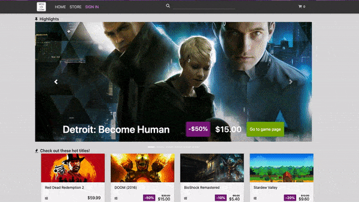
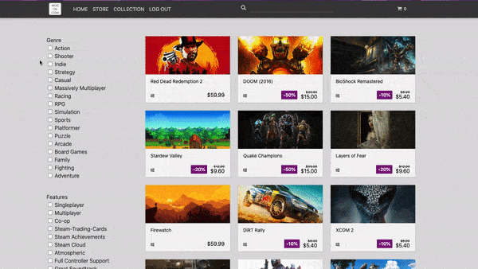
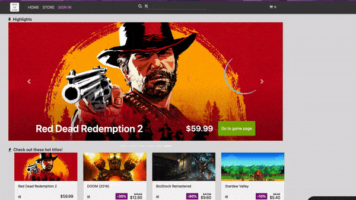
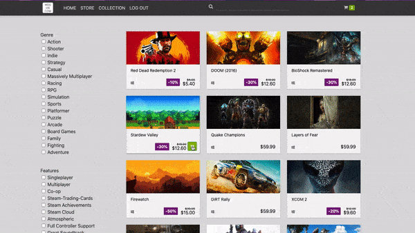
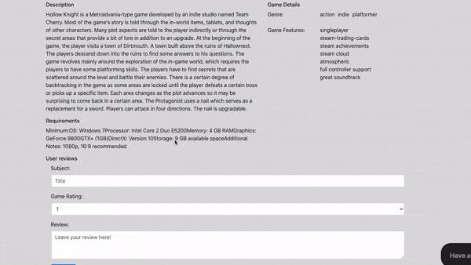
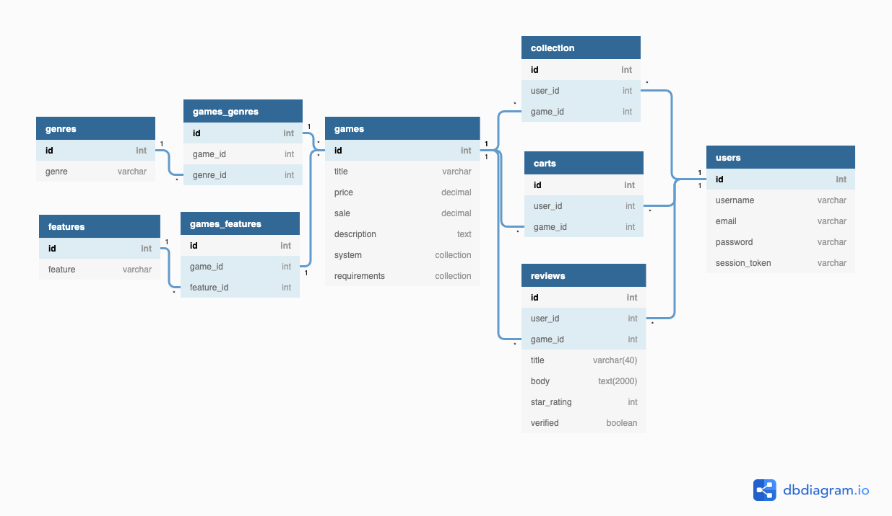

   

---

### An e-commerce platform for video games

---

Welcome to WOGOS! WOGOS is a single page application made with React / Redux, Flask, and PostgreSQL. It is inspired by [GOG](https://gog.com/), a popular digital distributor of video games. Our shameless mission is to grant Windows the monopoly in computer games.

---

### WOGOS uses the following technologies:

- Frontend - JavaScript | React | Redux
- Backend - Python | Flask
- Database - PostgreSQL
- Design - HTML5 / CSS

---

## Features 
      
### Authentication 
Create an account or use demo login, secure with JWT token and SHA-256 hashing  

        
 
     
### Faceted Search Filters 

   Apply multiple filters across genres and features to your search results

    
    

     
### Dynamic Search Bar 
Get recommended results as you type
      
     
     

### Shopping Cart  
Add or remove items from your cart, and checkout items into your collection  
        

    
### Product Reviews 
Leave a review for items that you have purchased
    
    

---
### Schema

